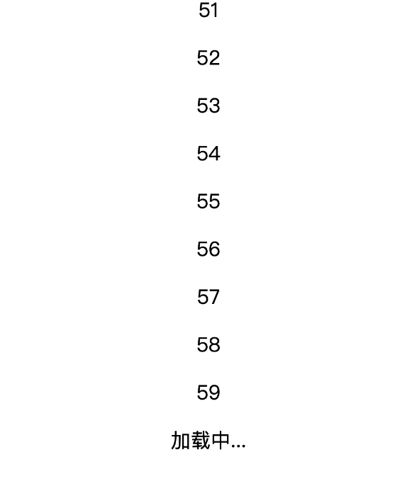

>前言：过去，要检测一个元素是否可见或者两个元素是否相交并不容易，比如实现图片懒加载、内容无限滚动等功能时，都需要通过​getBoundingClientRect()​写大量的逻辑计算或者依靠scroll事件监听等性能很差方式来实现。

>现在，依靠IntersectionObserver我们能非常便捷且高效的实现上述功能。

## API

```js
// 创建实例
const observer = new IntersectionObserver(callback, option);
 
// 开始观察element1
observer.observe(element1);
 
// 开始观察element2
observer.observe(element2);
 
// 停止观察
observer.unobserve(element);
 
// 关闭观察器
observer.disconnect();
```
IntersectionObserver是浏览器原生提供的构造函数，接受两个参数：callback是可见性变化时的回调函数，option是配置对象（该参数可选）。

构造函数的返回值是一个观察器实例。实例的observe方法可以指定观察哪个 DOM 节点，如果需要观察多个DOM节点可以多次添加observe方法。

## callback参数
当以下情况发生时会调用回调函数：

+ Observer 第一次监听目标元素的时候
每当目标元素与设备视窗或者其他指定元素发生交集的时候执行

+ callback函数的参数（entries）是一个数组，每个成员都是一个IntersectionObserverEntry对象。举例来说，如果同时有两个被观察的对象的可见性发生变化，entries数组就会有两个成员。

每个IntersectionObserverEntry对象属性含义如下：

+ boundingClientRect：目标元素的矩形区域的信息
+ intersectionRatio：目标元素的可见比例，即intersectionRect占boundingClientRect的比例，完全可见时为1，完全不可见时小于等于0
+ intersectionRect：目标元素与视口（或根元素）的交叉区域的信息
+ rootBounds：根元素的矩形区域的信息，getBoundingClientRect()方法的返回值，如果没有根元素（即直接相对于视口滚动），则返回null
+ isIntersecting：目标元素是否与视口（或根元素）交叉
+ isVisible：并未查阅到相关资料，且经过测试其并不会发生变化
+ target：被观察的目标元素，是一个 DOM 节点对象
+ time：可见性发生变化的时间，是一个高精度时间戳，单位为毫秒


## Option对象
IntersectionObserver构造函数的第二个参数是一个配置对象。它可以设置以下属性。

+ root：指定根元素，用于检查目标的可见性。必须是目标元素的父级元素。如果未指定或者为null，则默认为浏览器视窗。
+ rootMargin：根元素的外边距，类似于 CSS 中的margin属性。
+ threshold：目标元素与根元素的交叉比例，可以是单一的 number 也可以是 number 数组，比如，[0, 0.25, 0.5, 0.75, 1]就表示当目标元素 0%、25%、50%、75%、100% 可见时，会触发回调函数。


## 注意点

IntersectionObserver API 是异步的，不随着目标元素的滚动同步触发。
注册的回调函数将会在主线程中被执行，所以该函数执行速度要尽可能的快。如果有一些耗时的操作需要执行，建议使用 Window.requestIdleCallback() 方法。

## 示例：无限滚动

```html
<!DOCTYPE html>
<html lang="en">
<head>
  <meta charset="UTF-8">
  <title>IntersectionObserver</title>
</head>
<body style="font-size: 24px;text-align: center">
<div id="container"></div>
<div id="loadMore">加载中...</div>
</body>
<script>
  const container = document.querySelector('#container');
  const loadMore = document.querySelector('#loadMore');
  let index = 0;
 
  const loadItems = (count) => {
    [...Array(count).keys()].forEach((key) => {
      const p = document.createElement('P');
      p.innerHTML = `${key + index}`;
      container.appendChild(p)
    })
    index += count;
  }
 
  const observer = new IntersectionObserver((entries) => {
    entries.forEach(({ isIntersecting }) => {
      if (isIntersecting) {
        loadItems(20);
      }
    })
  });
 
  observer.observe(loadMore)
</script>
</html>
```
无限滚动（infinite scroll）的实现也很简单。通过观察#loadMore元素与浏览器视图的是否交叉，如果交叉则意味着列表已经加载完毕，继续添加更多的元素。


## 参考


[Mdn文档](https://developer.mozilla.org/zh-CN/docs/Web/API/Intersection_Observer_API)

[阮一峰的网络日志](https://www.ruanyifeng.com/blog/2016/11/intersectionobserver_api.html)