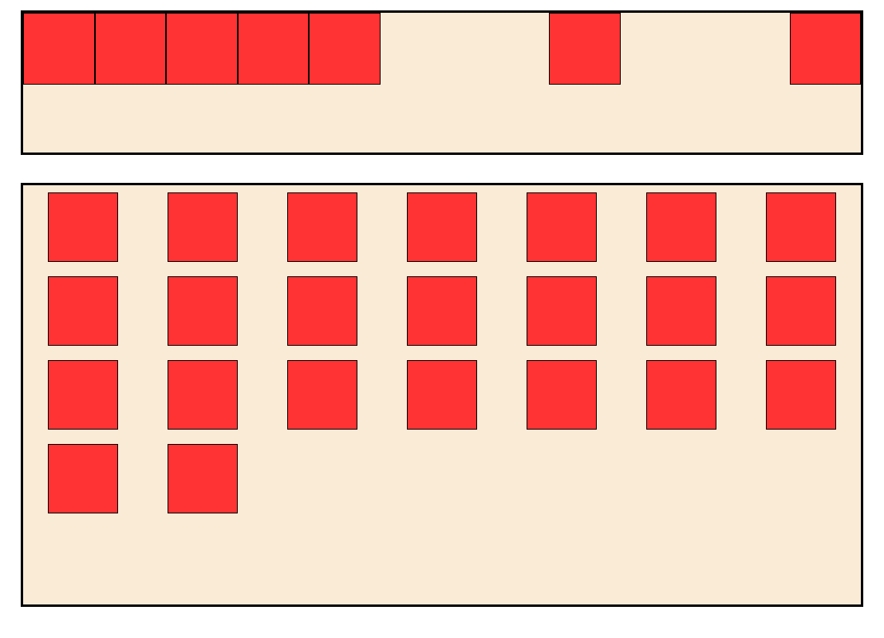

>今天分享两个常见的布局需求
>其实这两种布局只需要flex+margin即可实现
1. 第一种布局，利用flex盒子有剩余空间时使用margin:aoto可自动占满剩余空间，如左右都设置auto则将空间进行平分。
2. 第二种布局，根据flex盒子的宽度与n个item的宽度进行相见再平分，计算出每个item左右的margin值；页面如果是响应式布局，仅需动态修改--n即可。



>talk is cheap, show you my code!
```html
<!DOCTYPE html>
<head>
  <title>flex+margin</title>
  <style>
    .box,
    .box2 {
      margin: 20px auto;
      width: 600px;
      height: 100px;
      background-color: antiquewhite;
      border: 2px solid;
      display: flex;
    }

    .item {
      border: 1px solid;
      width: 50px;
      height: 50px;
      background-color: rgb(255, 51, 51);
    }

    .box .item:nth-child(6) {
      margin-left: auto;
      margin-right: auto;
    }

    .box2 {
      height: 300px;
      flex-wrap: wrap;
      /* 多行侧轴对齐方式 */
      align-content: flex-start;
    }

    .box2 .item {
      --n: 7;
      --gap: calc((100% - 50px * var(--n))/var(--n)/2);
      margin: 5px var(--gap);
    }
  </style>
</head>

<body>
  <div class="box">
    <div class="item"></div>
    <div class="item"></div>
    <div class="item"></div>
    <div class="item"></div>
    <div class="item"></div>
    <div class="item"></div>
    <div class="item"></div>
  </div>

  <div class="box2">
    <div class="item"></div>
    <div class="item"></div>
    <div class="item"></div>
    <div class="item"></div>
    <div class="item"></div>
    <div class="item"></div>
    <div class="item"></div>
    <div class="item"></div>
    <div class="item"></div>
    <div class="item"></div>
    <div class="item"></div>
    <div class="item"></div>
    <div class="item"></div>
    <div class="item"></div>
    <div class="item"></div>
    <div class="item"></div>
    <div class="item"></div>
    <div class="item"></div>
    <div class="item"></div>
    <div class="item"></div>
    <div class="item"></div>
    <div class="item"></div>
    <div class="item"></div>
  </div>
</body>
</html>
```
